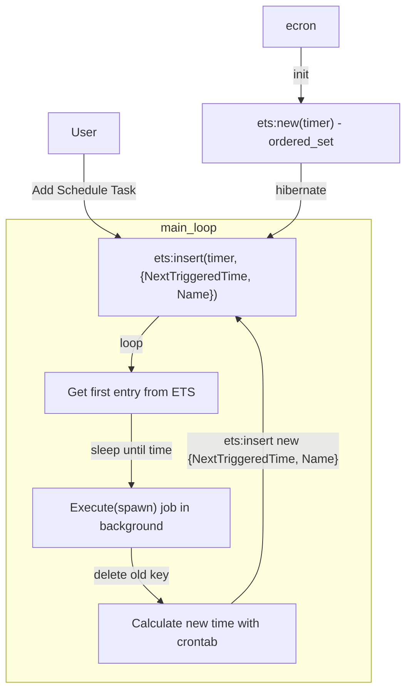

Modern applications rely heavily on job scheduling libraries to manage asynchronous tasks, recurring processes, and distributed workloads. While implementing scheduling tasks in naturally asynchronous environments like Erlang and Elixir is straightforward, building a reliable and efficient solution requires careful consideration.

## A Simple Scheduling Task

```erlang
init([]) –>
   erlang:send_after(next_report_time(),self(),report_event),
   {ok, #state{}}.
handle_info(report_event, State) –>
   NewState = do_report_event(State),%% maybe spawn for heavy task
   erlang:send_after(next_time_report(),self(),report_event),
   {noreply, NewState}.
```

In this approach, we need to implement the `next_report_time()` function each time. Could we abstract this repetitive work into a standardized expression?

```shell
# * * * * * <command to execute>
# | | | | |
# | | | | day of the week (0–6) Sunday to Saturday
# | | | month (1–12)            
# | | day of the month (1–31)
# | hour (0–23)
# minute (0–59)
```

The [cron utility](https://en.wikipedia.org/wiki/Cron) has maintained its position as the dominant task scheduler in Unix-like systems for over four decades, with most Linux servers relying on cron jobs for automated operations. The crontab expression syntax achieves an optimal balance between **simplicity (5 fields) and expressiveness (10^15 possible schedules)**. We only need to calculate the next report time through this expression.

## A Crontab Scheduling Task

```erlang /"0 8 * * 1"/
init([]) –>
   % report at At 08:00 on Monday.
   ecron:send_after("0 8 * * 1",self(),report_event),
   {ok, #state{}}.
handle_info(report_event, State) –>
   NewState = do_report_event(State),% maybe spawn for heavy task
   ecron:send_after("0 8 * * 1",self(),report_event),
   {noreply, NewState}.
```

While this solves the calculation problem for `next_report_time`, writing 100 separate gen_servers for 100 crontab tasks would be inefficient. The Erlang stdlib's timer module addresses this with [timer:send_interval/3](https://www.erlang.org/doc/apps/stdlib/timer.html#send_interval/3):

```erlang
timer:send_interval(next_report_time(), DestPid, report_event).
```

Combined with crontab, this becomes:

```erlang
ecron:send_interval("0 8 * * 1" DestPid, report_event).
```

Once we define the API, we need to implement ecron's internals. We can start by understanding how timer works, then replace the millisecond parameter with a crontab expression.

## Timer in stdlib

Timer is a standalone gen_server process that manages all timers using an ordered set ETS table, rather than one timer per process. It:

1. Examines the task at the head of the ETS table and calculates execution time
2. Sleeps until that time arrives
3. Executes the task in the background using spawn
4. Calculates the next execution time and places it back in the ETS table

This approach is efficient - a single process handles all timing, using only one timer for the next upcoming task regardless of how many tasks (even 100+) are scheduled.

To create ecron, we simply need to integrate crontab expression parsing to calculate the next trigger time within the timer module.



But how do we calculate NextTriggeredTime from a crontab expression?

## Find Next Triggered Time

One straightforward approach is to use `calendar:system_time_to_local_time(Time,second)` for each time increment and check if it matches the crontab. This method is simple and reliable but inefficient for long time spans due to numerous conversions.
```erlang
next_trigger_time(Spec, TimeSec) ->
Next = calendar:system_time_to_local_time(TimeSec,second),
case check_crontab_spec(Spec, Next) of
  true -> Next;
  false -> next_trigger_time(Spec, TimeSec + 1)
end.
```

A more efficient method uses `erlang:localtime()` combined with crontab parameters for direct calculation. For example:
- Crontab: "0 8 * 1-6 *" → minute must be 0, hour must be 8, month must be between 1-6
- Current time (`erlang:localtime()`): {{2025, 1, 1}, {1, 1, 0}}
- Next execution: {{2025, 1, 1}, {8, 0, 0}}

We then convert this to system time via `calendar:local_time_to_system_time/2`, subtract the current time, and get the time until the next trigger. This method requires far fewer iterations to find the next trigger time.

We can validate our second implementation by comparing results with the first methods using property-based testing.

With core functionality complete, we should consider task constraints:

## Task Constraints
For tasks that run too long, implement a kill mechanism:
```erlang
{Pid, Ref} = spawn_monitor(?MODULE, spawn_mfa, [Name, MFA]),
    receive
        {'DOWN', Ref, process, Pid, _Reason} ->
            ok
    after MaxRuntimeMs ->        
        exit(Pid, kill)
    end.
```

## Logging with Telemetry
When tasks crash or time out, we can log events using error_logger or, better yet, emit [telemetry events](https://github.com/beam-telemetry/telemetry) for flexible handling:
```erlang
{Pid, Ref} = spawn_monitor(?MODULE, spawn_mfa, [Name, MFA]),
    receive
        {'DOWN', Ref, process, Pid, _Reason} ->
            ok
    after MaxRuntimeMs ->        
        telemetry:execute(
              [ecron, aborted],
                #{
                    run_microsecond => MaxRuntimeMs,
                    action_at => current_millisecond()
                },
                #{
                  name => Name,
                  mfa => MFA
                 }
            ),
        exit(Pid, kill)
    end.
```

A simple telemetry handler for logging:

```erlang
-include_lib("kernel/include/logger.hrl").
attach() ->    
    Function = fun handle_event/4,
    Config = undefined,
    telemetry:attach_many(?MODULE, ?Events, Function, Config).

detach() ->
    telemetry:detach(?MODULE).

handle_event([ecron, aborted], Event, #{name := JobName}, _Config) ->    
    ?LOG(error, Event#{action => Action, name => JobName});    
...
```

Users who need custom handling (like sending email alerts) can implement their own telemetry handlers.

## Ecron v1.1.0 is now available

[Ecron](https://github.com/zhongwencool/ecron) is compact yet powerful, with core functionality in just 1,100 lines of code. It uses property testing with 2,300 lines of test code for 99%+ coverage and includes 800 lines of documentation. Created 6 years ago with 130+ commits and 13 tags, it has yet to receive any bug reports (though this may reflect its user base size 😅).

Interested in cluster-wide singleton tasks or want to start directly? 

Explore the [official hexdocs](https://hexdocs.pm/ecron/) and unlock the full potential of job scheduling in beam in minutes. Share your experiences, suggest features, or contribute. The `ecron` project thrives on community input to evolve and address real-world use cases!

Happy scheduling  in this asynchronous wonderland of BEAM 📅 !